# 그물 🎣🕸️

**그** 때의  
**물** 때...
🐟🐠🐡🫧

> *매일같이 출조出釣 나가는 당신만의 물고기 도감*

🥇삼성 청년 SW아카데미(SSAFY) 12th 특화 프로젝트 우수상🥇
ㅤ  
## 😊개발자 소개

| developer  | role | git| etc.|
|--------|----------|---|-----------|
| 손재민 | FE       | - |     -     |
| 이국건 | Infra/FE | - |     -     |
| 이수정 | FE/BE    | - |     -     |
| 정주하 | AI/FE    | - |     -     |
| 조윤장 | AI/Data  | - |     -     |
| 황치운 | AI/BE    | - |     -     |

ㅤ
## 🗃️기술스택
### Front-End

### Back-End & DB

### AI

### Infra

### Cooperation

---

💻 1. 기여한 부분
⭐ 1) 수족관 메인 UI 및 인터랙션 구현
유저 정보, 수족관 가치, "더 많은.." 메뉴 등 상단 UI 구현

"더 많은.." 탭 클릭 시 애니메이션 메뉴 등장 (AnimationController, FadeTransition, SlideTransition 활용)

하단에서 물고기 선택 모달창이 자연스럽게 올라오도록 showModalBottomSheet 추가

⭐ 2) 물고기 애니메이션 로직 설계
FallingFish 클래스와 SwimmingFish 클래스를 설계해 물고기 낙하 ➝ 수영 상태 전환 처리

물고기가 떨어질 때 감속 애니메이션을 통해 현실적인 낙하 구현

Tween, Timer, progress 기반 속도 조절 등으로 애니메이션 정교화

⭐ 3) 물고기 수영 로직: 8방향 랜덤 이동 구현
물고기 낙하 후 수영 시작 시, 이동 방향을 상/하/좌/우/좌상/좌하/우상/우하(↗↘↙↖) 중 하나로 랜덤 지정

각 물고기마다 이동 시간(0~2초)과 멈춤 시간(2~5초)을 랜덤하게 계산해 자연스러운 수영 패턴 구현

각 방향별 (dx, dy) 벡터 계산 → 좌표 갱신

멈춤 상태에서도 Timer로 일정 시간 이후 자동 재이동되도록 로직 구성

다수의 물고기를 동시에 관리하기 위해 SwimmingFish 객체에 개별 상태(dx, dy, isPaused, pauseTimer, moveTimer) 포함

좌우 벽 충돌 시 방향 전환

⭐ 4) 물고기 추가 모달 기능 구현
사용자 맞춤형 모달 디자인 구현

핸들바(ㅡ) 추가하여 인터렉션이 가능하다는 직관적인 표현추가

Wrap UI로 다양한 물고기 선택 가능

선택 시 낙하 애니메이션 자동 실행

⭐ 5) 전체 애니메이션 통합 및 화면 구성
IndexedStack과 상태 관리로 하단 네비게이션 연동

수족관 페이지, 도감 페이지, 카메라 페이지 간 전환 흐름 설계

---

⚽ 2. 트러블슈팅 경험
❌문제 1: 물고기 낙하 후 이미지가 2개 보이는 이슈

상황 : 물고기 선택 후 낙하하면, 중앙에 낙하된 물고기와 헤엄치는 물고기 둘 다 보여서 중복 표시됨

해결: fish.top <= targetY - 2 조건을 추가하여 착수 시점 정확히 판별하고, fallingFishes에서 제거한 뒤 swimmingFishes에만 추가되도록 처리

❌ 문제 2: 낙하 속도 일정해서 어색함

해결: progress 값을 이용해 감속 구현 — currentSpeed = baseSpeed * (1 - progress)

물고기가 초반에 빠르게, 끝에서는 느리게 착수하게 함

❌ 문제 3: 모달창 크기가 작아서 몰입감 부족

해결: MediaQuery.of(context).size.width와 isScrollControlled: true 설정으로 모달을 양쪽에 꽉 차게 변경

상단에 Container(width: 40, height: 5) 추가하여 사용자가 "드래그 가능한 모달"로 인식하게끔 개선

---

회 go 

---

## 🐟주요 기능

### 🐳메인화면(어항)
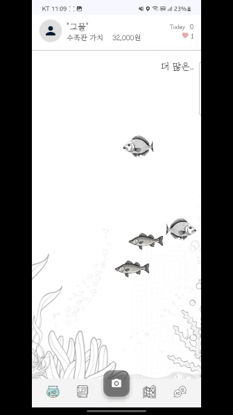

- 내가 잡은 물고기를 어항에 추가할 수 있음
- 동적인 물고기 움직임 구현

### 📖물고기 도감
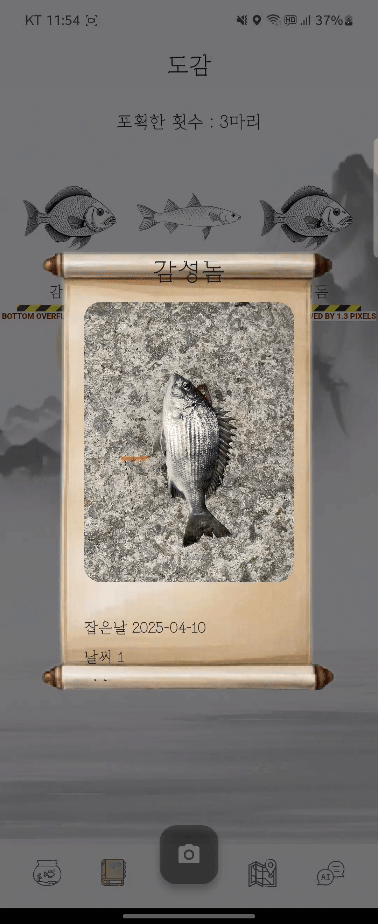
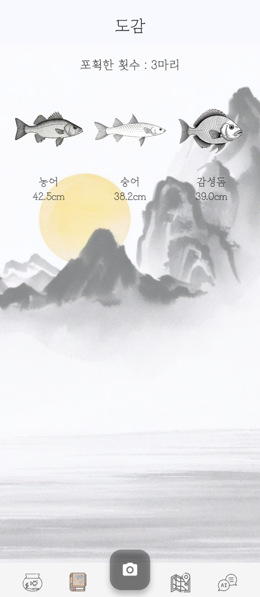

- 수집한 물고기 정보 저장 (어종 및 사진, 크기 환경 등)
- 수집한 물고기를 확인

---

### 🎣물고기종 분류 및 길이 측정

#### 물고기 분류

- AR기술을 활용한 가늠자없는 길이측정
- ResNet50 AI를 활용하여 약 26종의 물고기 판별
- 데이터 증강기법 사용
- 94%의 정확도 달성

#### 데이터
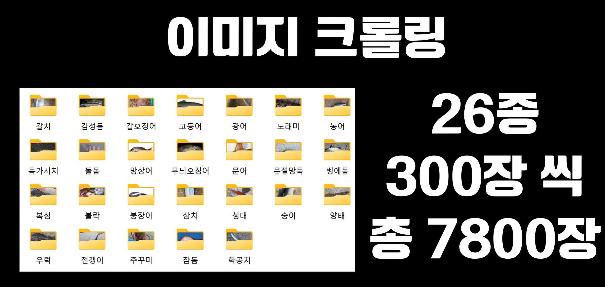

- 필터링 후 총 3228장의 이미지 학습

#### 길이측정
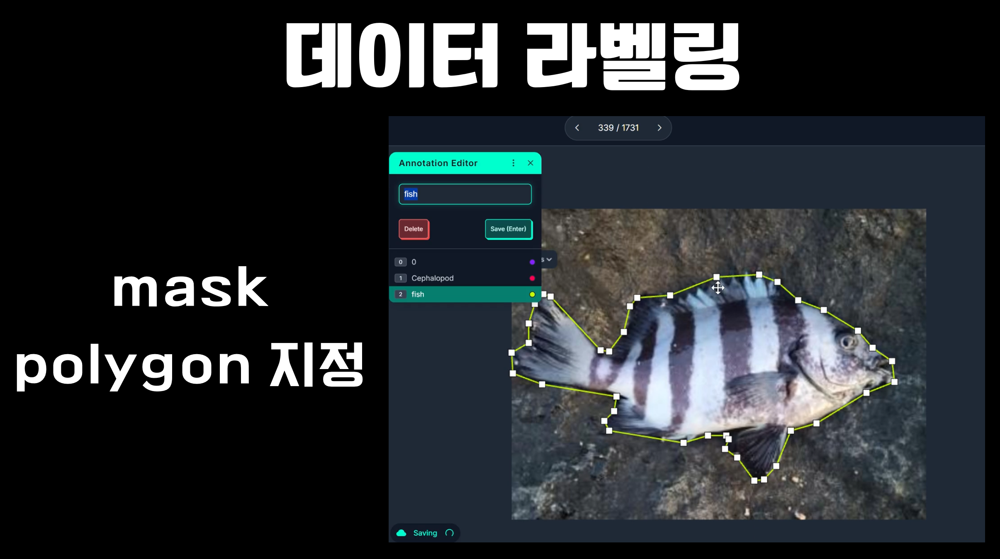

- 데이터 라벨링 mask polygon 지정

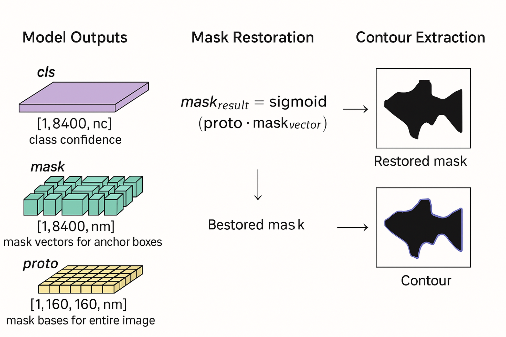
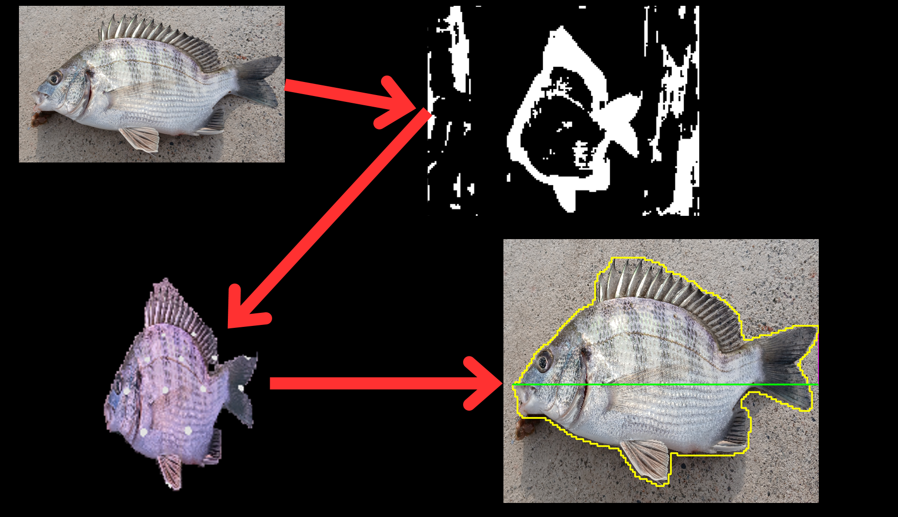

- Yolov8 Instance Segmentation을 이용해 윤곽 검출

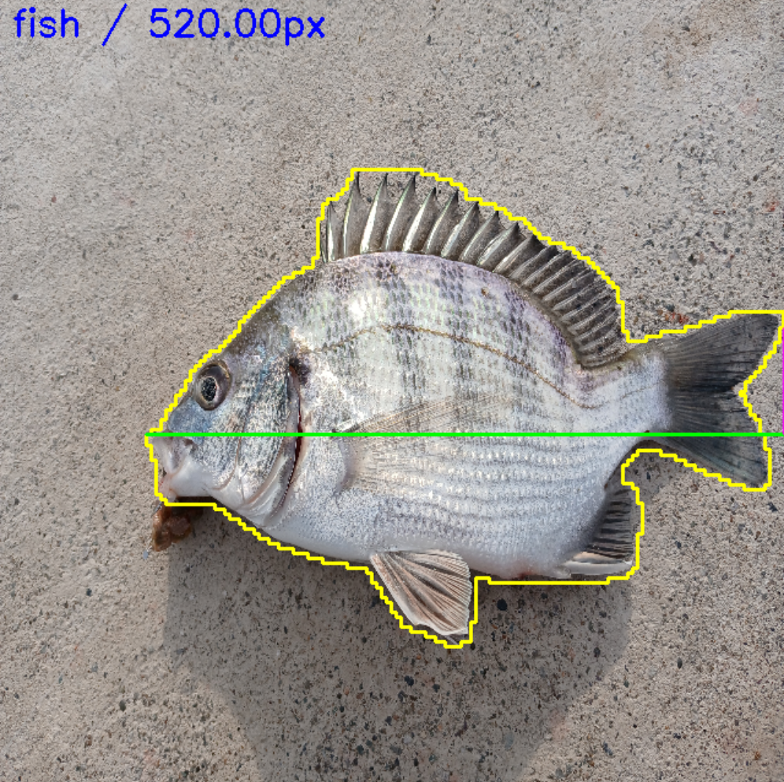

- 물고기 길이 픽셀 측정

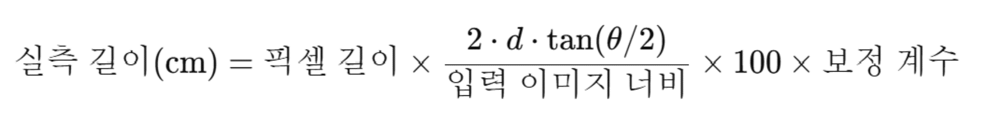

- AR기반 카메라와 물고기간 거리를 구해 실측거리 계산
- 가늠자 없는 Only Cam방식

---

#### OnDevice
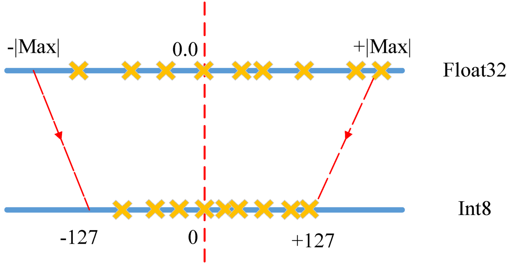

- 양자화 인지 학습 진행

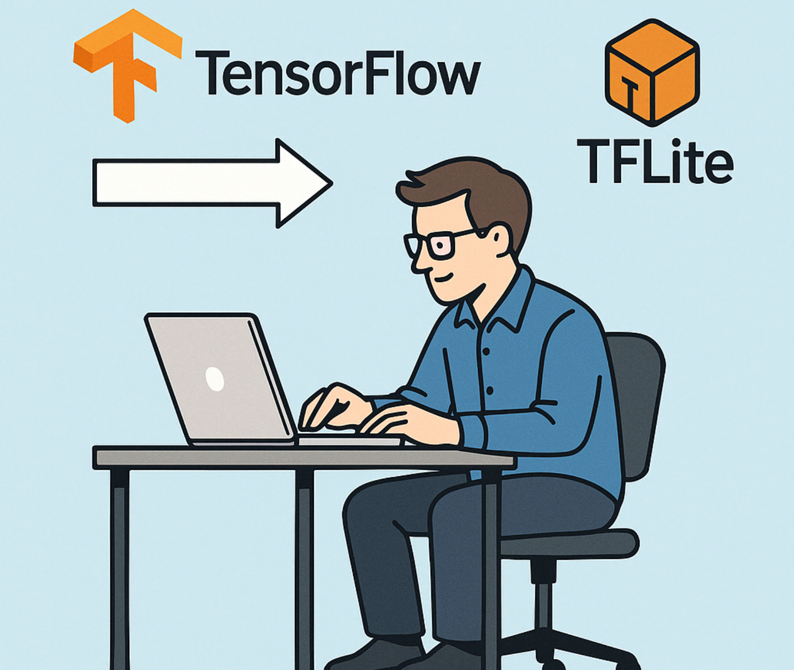

- TFLite 변환

---

### 🚩낚시 포인트 정보 제공 (지도 형식)

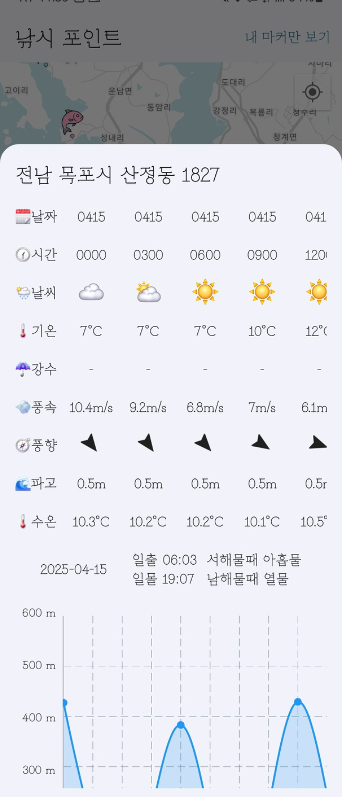

- 포인트 별 물때, 날씨, 수온, 출몰 어종 등 낚시에 필요한 정보 제공
- 낚시 포인트 공유 기능
- 나만의 낚시포인트 저장(환경 정보 제공)

---

### 🤖챗봇

- Open AI를 활용한 챗봇
- 낚시 컨셉에 맞게 프롬프트하여 제작
- RAG 기반의 LLM 모델로 낚시 관련 전문 지식을 제공

---

### 부가 기능
- 방문자 수, 좋아요 수, 수족관 가치 확인 가능
- 방명록, 랭킹 기능 제공

---

#### 📱앱 컨셉
- 흑백과 포인트 컬러의 조합  
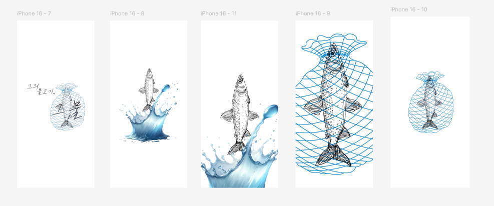
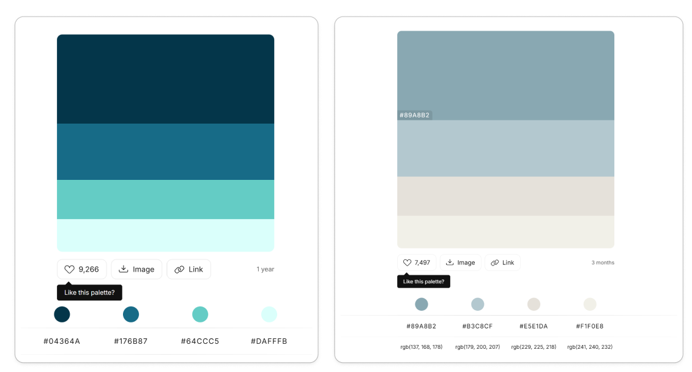

---

## 📖명세서

### [💫UI Draft(Wire Frame)](https://www.figma.com/design/aFHv2WqsWfpDcSpTyc6GST/-%ED%8A%B9%ED%99%94-%ED%94%BC%EA%B7%B8%EB%A7%88-%EB%94%94%EC%9E%90%EC%9D%B8?node-id=0-1&p=f&t=fr7VlhcHYSwxK9Qv-0)

### [📖Sequence Diagram & Idea Board](https://www.figma.com/board/gpobQfMnjRWzcn9z3rZtBo/-%ED%8A%B9%ED%99%94-%ED%98%91%EC%97%85%EB%B3%B4%EB%93%9C?node-id=0-1&p=f&t=7M8H351F2Qwb2Ra1-0)

### 💾ERD
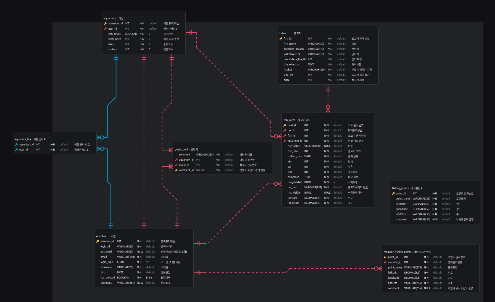

---

## 🎥 관련영상
[그물 앱 UCC](https://www.youtube.com/watch?v=zMpmVm-oTsA)
